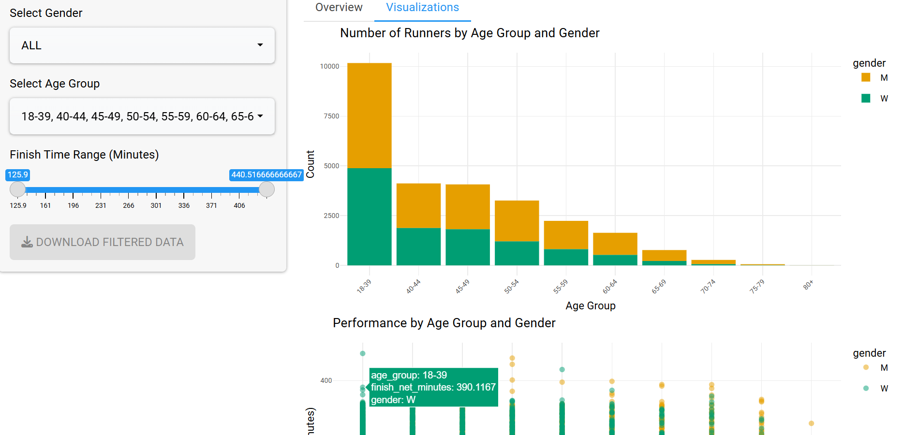

# 💡 Exemplary Code: Interactive Shiny Dashboard for Boston Marathon 2023

This project demonstrates an interactive data dashboard built using `Shiny`, allowing users to dynamically explore runner performance from the 2023 Boston Marathon.

---

## 🧭 Purpose

The dashboard allows users to:
- Filter runners by **gender**, **age group**, and **finish time**
- View dynamic **visualizations** and **summaries**
- **Download** filtered subsets of the dataset

---

## 📦 Technologies Used

- **Language**: R
- **Framework**: `shiny`
- **Visualization**: `ggplot2`, `plotly`
- **Widgets/UI**: `shinyWidgets`, `bslib`, `DT`

---

## ⚙️ Key Features

- **Dynamic Filters**:
  - Dropdown menus for gender and age group
  - Slider for finish time range
- **Visual Output**:
  - 📊 Bar chart: Number of runners by group
  - 🔵 Scatterplot: Finish time vs. age group
  - 🧾 Summary table with averages
- **Downloadable** filtered data via `downloadHandler`

---

## 🖼 Preview

Below is a snapshot of the working app:



---

## 🚀 How to Run

```r
library(shiny)
runApp("app_corrected.R")
```

Make sure the dataset (`boston_marathon_2023.csv`) is available in the working directory.

---

## 🧠 Why This Matters

This Shiny App showcases:
- UI/UX design for interactive analytics
- Grouped data summaries with tidyverse pipelines
- Customizable user interface with responsiveness

---

## 👤 Author

**Byeolha Kim**  
M.A. Candidate, International Economics  
American University  
📧 bk4098a@american.edu  
🔗 [GitHub App Repo](https://github.com/bk4098a/boston-marathon-app)
